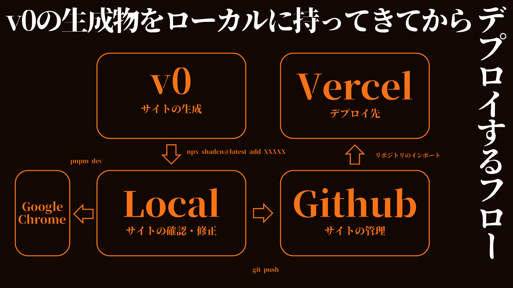

# NERV CIC


https://github.com/user-attachments/assets/4586249e-0bb9-4b82-8ed9-b716e14a9a99

このプロジェクトは、NERV（特殊機関ネルフ）の指令センター用ダッシュボードを模したNext.jsアプリケーションです。エヴァンゲリオンの世界観をモチーフにした、リアルタイムモニタリングシステムのデモンストレーションです。

## 機能

- リアルタイムの使徒検知システム
- エヴァンゲリオン稼働状況モニター
- パイロットのバイタルサイン表示
- MAGIシステムステータス
- 警戒レベルインジケーター
- 緊急事態発令ボタン

## 開発フロー



このプロジェクトは以下のフローに沿って開発されています：

1. **v0 (サイトの生成)**: 初期のサイト構造とコンテンツを生成します。
2. **Local (サイトの確認・修正)**: 
   - `npx shaden@latest add XXXXX` コマンドを使用して、必要な依存関係やコンポーネントを追加します。
   - `pnpm dev` コマンドを使用してローカル環境でサイトを起動します。
   - Google Chromeを使用してサイトの表示を確認し、必要に応じて修正を行います。
3. **Github (サイトの管理)**:
   - 変更をコミットし、`git push` コマンドを使用してGithubリポジトリにプッシュします。
4. **Vercel (デプロイ先)**:
   - GithubリポジトリからVercelにプロジェクトをインポートし、自動デプロイを設定します。

このフローにより、ローカルでの開発、バージョン管理、そして自動デプロイまでのシームレスな開発プロセスを実現しています。

## 始め方

このプロジェクトは[Next.js](https://nextjs.org/)を使用して構築されています。

### 前提条件

- Node.js (バージョン14.0.0以上)
- pnpm (パッケージマネージャーとして使用)

### インストール

1. リポジトリをクローンします：

```bash
git clone https://github.com/your-username/nerv_cic.git
cd nerv_cic
```

2. 依存関係をインストールします：

```bash
pnpm install
```

### 開発サーバーの起動

```bash
pnpm dev
```

[http://localhost:3000](http://localhost:3000)をブラウザで開いてアプリケーションを確認してください。

## 使用技術

- [Next.js](https://nextjs.org/) - Reactフレームワーク
- [React](https://reactjs.org/) - UIライブラリ
- [Tailwind CSS](https://tailwindcss.com/) - CSSフレームワーク
- [Lucide React](https://lucide.dev/) - アイコンライブラリ
- [Vercel](https://vercel.com/) - デプロイメントプラットフォーム

## プロジェクト構造

```
nerv_cic/
├─ app/               # Next.js 13のApp Router構造
│  ├─ layout.tsx      # アプリケーションのルートレイアウト
│  ├─ page.tsx        # メインページコンポーネント
├─ components/        # Reactコンポーネント
│  ├─ nerv-dashboard.tsx  # メインダッシュボードコンポーネント
├─ lib/               # ユーティリティ関数
├─ public/            # 静的ファイル
```

## カスタマイズ

`components/nerv-dashboard.tsx`ファイルを編集することで、ダッシュボードの外観や機能をカスタマイズできます。

## デプロイ

このプロジェクトはVercelを使用して自動デプロイするように設定されています。Githubリポジトリにプッシュするだけで、Vercelが自動的に新しいバージョンをデプロイします。

## 貢献

プロジェクトへの貢献を歓迎します。プルリクエストを送る前に、変更内容についてissueで討議することをお勧めします。

## ライセンス

このプロジェクトはMITライセンスの下で公開されています。詳細は[LICENSE](LICENSE)ファイルを参照してください。
